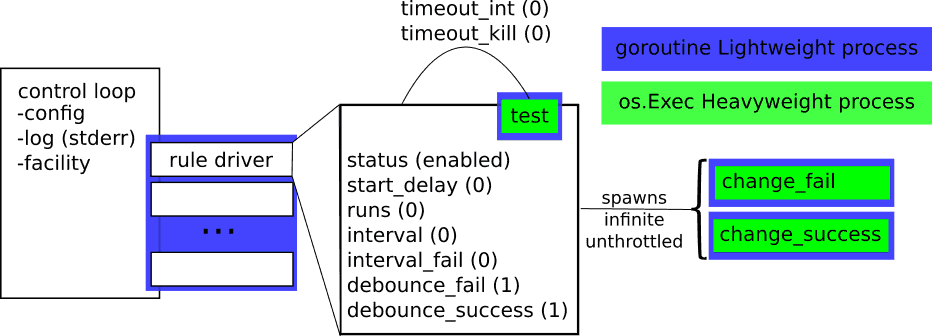

# hfm (High Frequency Monitor)

hfm is an application to run tests in parallel at a high frequency. If the
outcome of the test results in a state change, other commands can be executed.

It is designed to be a general purpose, loosely-coupled tool, by having both
the tests and the state change commands be executed by the operating system.
For example, one could write the test in shell or c, and have it called through
the exec facility.

In practice, the overhead of spawning a new process per test limits frequency
that can be achieved by the tests, and their results.  Anecdotally, 5ms
intervals have been seen to be achievable.

An example application is to poll other network services for health, and to
take actions based on their health status changes.

## Design

hfm is not currently a real-time monitor.

Scheduling is managed using Go's time.Sleep, which currently only guarantees it
"pauses the current goroutine for at least the duration d".  Therefore tests
will run by "at least" the interval you specify.  Scheduling in this way
ensures that we are not creating a backlog (or flood) of tests, should a test
execute for longer than the specified interval.

This may give a false confidence about any statistics that are generated by the
system, due to Coordinated Omission.

## Architecture

The control loop spawns one rule driver per rule.  The driver takes care of all
of the bookkeeping of the rule for its lifetime.  Each test is run as a 
heavyweight os process, which can limit the actual frequency that tests can run
at.  Additionally, the state change commands are run as a heavyweight os
process, and are just spawned at the rate they are needed.  High-frequency
state changes may become a problem, as the spawn rate is not throttled, nor are
these child processes monitored.  [Debouncing](https://en.wikipedia.org/wiki/Debounce#Contact_bounce)
the state change may help to alleviate this.

## Building

There's a patch-local-go-libucl make target that will allow you to use the
locally installed libucl vs. a vendorized version.

